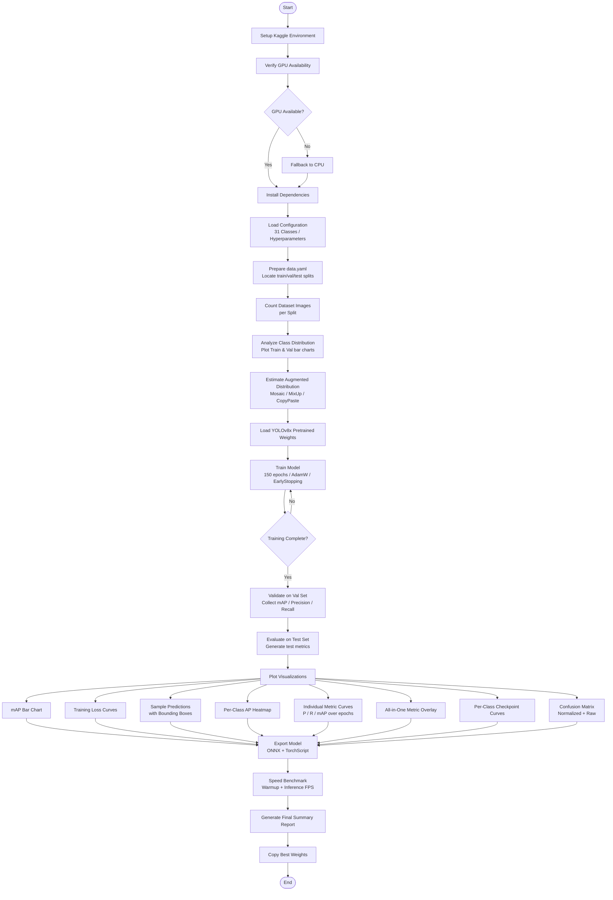
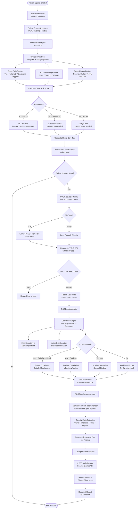
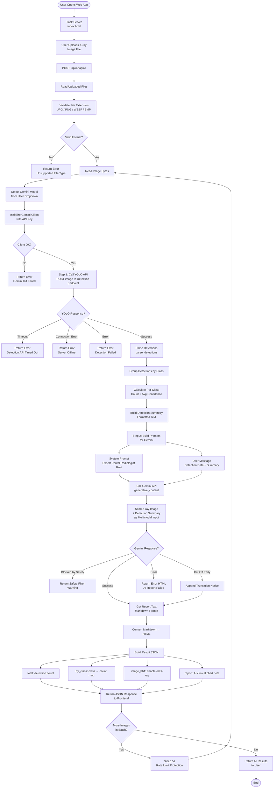

# 🦷 Activity Diagrams — Dental AI System

---

## 1. YOLOv8x Detection Training Pipeline

```mermaid
flowchart TD
    A([Start]) --> B[Setup Kaggle Environment]
    B --> C[Verify GPU Availability]
    C --> D{GPU Available?}
    D -- No --> E[Fallback to CPU]
    D -- Yes --> F[Install Dependencies]
    E --> F
    F --> G[Load Configuration\n31 Classes / Hyperparameters]
    G --> H[Prepare data.yaml\nLocate train/val/test splits]
    H --> I[Count Dataset Images\nper Split]
    I --> J[Analyze Class Distribution\nPlot Train & Val bar charts]
    J --> K[Estimate Augmented Distribution\nMosaic / MixUp / CopyPaste]
    K --> L[Load YOLOv8x Pretrained Weights]
    L --> M[Train Model\n150 epochs / AdamW / EarlyStopping]
    M --> N{Training Complete?}
    N -- No --> M
    N -- Yes --> O[Validate on Val Set\nCollect mAP / Precision / Recall]
    O --> P[Evaluate on Test Set\nGenerate test metrics]
    P --> Q[Plot Visualizations]
    Q --> Q1[mAP Bar Chart]
    Q --> Q2[Training Loss Curves]
    Q --> Q3[Sample Predictions\nwith Bounding Boxes]
    Q --> Q4[Per-Class AP Heatmap]
    Q --> Q5[Individual Metric Curves\nP / R / mAP over epochs]
    Q --> Q6[All-in-One Metric Overlay]
    Q --> Q7[Per-Class Checkpoint Curves]
    Q --> Q8[Confusion Matrix\nNormalized + Raw]
    Q1 --> R[Export Model\nONNX + TorchScript]
    Q2 --> R
    Q3 --> R
    Q4 --> R
    Q5 --> R
    Q6 --> R
    Q7 --> R
    Q8 --> R
    R --> S[Speed Benchmark\nWarmup + Inference FPS]
    S --> T[Generate Final Summary Report]
    T --> U[Copy Best Weights]
    U --> V([End])
```

---

## 2. Dental AI Chatbot

```mermaid
flowchart TD
    A([Patient Opens Chatbot]) --> B[Serve index.html\nFastAPI Frontend]
    B --> C[Patient Enters Symptoms\nPain / Swelling / History]
    C --> D["POST /api/analyze-symptoms"]
    D --> E[SymptomAnalyzer\nWeighted Scoring Algorithm]
    E --> E1[Score Pain Factors\nType / Intensity / Duration / Triggers]
    E --> E2[Score Swelling Factors\nFever / Severity / Trismus]
    E --> E3[Score History Factors\nTrauma / Broken Tooth / Last Visit]
    E1 --> F[Calculate Total Risk Score]
    E2 --> F
    E3 --> F
    F --> G{Risk Level?}
    G -- "Score < 25" --> H1["🟢 Low Risk\nRoutine checkup suggested"]
    G -- "25 ≤ Score < 50" --> H2["🟡 Moderate Risk\nX-ray recommended"]
    G -- "Score ≥ 50" --> H3["🔴 High Risk\nUrgent X-ray needed"]
    H1 --> I[Generate Home Care Tips]
    H2 --> I
    H3 --> I
    I --> J[Return Risk Assessment\nto Frontend]
    J --> K{Patient Uploads X-ray?}
    K -- No --> V([End Session])
    K -- Yes --> L["POST /api/detect-xray\nUpload Image or PDF"]
    L --> L1{File Type?}
    L1 -- PDF --> L2[Extract Images from PDF\nPyMuPDF]
    L1 -- Image --> L3[Pass Through Directly]
    L2 --> M[Forward to YOLO API\nwith Retry Logic]
    L3 --> M
    M --> N{YOLO API Response?}
    N -- Error --> N1[Return Error to User]
    N -- Success --> O[Return Detections\n+ Annotated Image]
    O --> P["POST /api/correlate"]
    P --> Q[CorrelationEngine\nMatch Symptoms ↔ Detections]
    Q --> Q1[Map Detection to\nDental Quadrant]
    Q --> Q2[Match Pain Location\nto Detection Region]
    Q --> Q3{Location Match?}
    Q3 -- "Yes + Pain Type Match" --> Q4["Strong Correlation\nDetailed Explanation"]
    Q3 -- "Yes + Swelling" --> Q5["Swelling Correlation\nInfection Warning"]
    Q3 -- "Yes only" --> Q6["Location Correlation\nGeneral Finding"]
    Q3 -- No --> Q7["Additional Finding\nNo Symptom Link"]
    Q4 --> R[Sort by Severity\nReturn Correlations]
    Q5 --> R
    Q6 --> R
    Q7 --> R
    R --> S["POST /api/treatment-plan"]
    S --> T[DentalTreatmentRecommender\nRule-Based Expert System]
    T --> T1[Classify Each Detection\nCavity / Impacted / Filling / Implant]
    T1 --> T2[Generate Treatment Plan\nper Finding]
    T2 --> T3[List Specialist Referrals]
    T3 --> U["POST /api/ai-report\nSend to Gemini API"]
    U --> U1[Gemini Generates\nClinical Chart Note]
    U1 --> U2[Return AI Report\nto Frontend]
    U2 --> V([End Session])
```

---

## 3. Treatment Recommendation System

```mermaid
flowchart TD
    A([User Opens Web App]) --> B[Flask Serves\nindex.html]
    B --> C[User Uploads X-ray\nImage File]
    C --> D["POST /api/analyze"]
    D --> E[Read Uploaded Files]
    E --> F[Validate File Extension\nJPG / PNG / WEBP / BMP]
    F --> G{Valid Format?}
    G -- No --> G1[Return Error\nUnsupported File Type]
    G -- Yes --> H[Read Image Bytes]
    H --> I[Select Gemini Model\nfrom User Dropdown]
    I --> J[Initialize Gemini Client\nwith API Key]
    J --> K{Client OK?}
    K -- No --> K1[Return Error\nGemini Init Failed]
    K -- Yes --> L["Step 1: Call YOLO API\nPOST image to Detection Endpoint"]
    L --> M{YOLO Response?}
    M -- Timeout --> M1[Return Error\nDetection API Timed Out]
    M -- Connection Error --> M2[Return Error\nServer Offline]
    M -- Error --> M3[Return Error\nDetection Failed]
    M -- Success --> N[Parse Detections\nparse_detections]
    N --> N1[Group Detections by Class]
    N1 --> N2[Calculate Per-Class\nCount + Avg Confidence]
    N2 --> N3[Build Detection Summary\nFormatted Text]
    N3 --> O["Step 2: Build Prompts\nfor Gemini"]
    O --> O1[System Prompt\nExpert Dental Radiologist Role]
    O --> O2[User Message\nDetection Data + Summary]
    O1 --> P["Call Gemini API\ngenerative_content"]
    O2 --> P
    P --> P1[Send X-ray Image\n+ Detection Summary\nas Multimodal Input]
    P1 --> Q{Gemini Response?}
    Q -- Blocked by Safety --> Q1[Return Safety Filter Warning]
    Q -- Cut Off Early --> Q2[Append Truncation Notice]
    Q -- Error --> Q3[Return Error HTML\nAI Report Failed]
    Q -- Success --> R[Get Report Text\nMarkdown Format]
    Q2 --> R
    R --> S[Convert Markdown → HTML]
    S --> T[Build Result JSON]
    T --> T1["total: detection count"]
    T --> T2["by_class: class → count map"]
    T --> T3["image_b64: annotated X-ray"]
    T --> T4["report: AI clinical chart note"]
    T1 --> U[Return JSON Response\nto Frontend]
    T2 --> U
    T3 --> U
    T4 --> U
    U --> W{More Images\nin Batch?}
    W -- Yes --> W1["Sleep 5s\nRate Limit Protection"]
    W1 --> H
    W -- No --> X[Return All Results\nto User]
    X --> Y([End])
```
