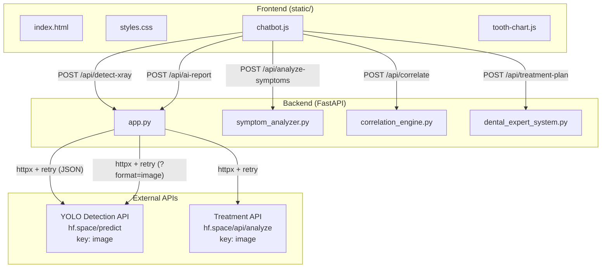

# 🦷 Assnani Dental AI Chatbot — Updated Implementation Plan

## Project Overview

The **Assnani Dental AI Chatbot** is a full-stack web app for a graduation project. It guides patients through a dental symptom interview, analyzes dental X-rays via YOLOv8-XL, correlates symptoms with findings, and generates assessment reports including a downloadable AI clinical PDF. Deployed on **Hugging Face Spaces** via Docker.

---

## Architecture

---

## External API Details

| API                   | URL                                                                  | Request Key | Response Format                                                                                      |
| --------------------- | -------------------------------------------------------------------- | ----------- | ---------------------------------------------------------------------------------------------------- |
| YOLO Detection (JSON) | `https://0xker-dental-x-ray-detection.hf.space/predict`              | `image`     | `{ results: [{ detections, filename, result_image_b64, total_detections }], success, total_images }` |
| YOLO Annotated Image  | `https://0xker-dental-x-ray-detection.hf.space/predict?format=image` | `image`     | Raw image bytes (annotated X-ray)                                                                    |
| Treatment / AI Report | `https://0xker-treat-recommend.hf.space/api/analyze`                 | `image`     | `{ results: { "filename": { total, by_class, image_b64, report, error } } }`                         |

> `report` field is **HTML-formatted** clinical chart note. `by_class` is a dict of `{ class_name: count }`.

Available Gemini models: `gemini-2.5-flash`, `gemini-2.0-flash`, `gemini-1.5-flash`, `gemini-1.5-pro` (currently using `gemini-2.5-flash`).

---

## Completed Work — All Phases

### Phase 1 — Bug Fixes ✅ DONE

- [x] Add `pydantic` to `requirements.txt`
- [x] Fix README to include `TREAT_API_URL` env var
- [x] **Fix X-ray upload sending 0 files** — `hideUpload()` was wiping `uploadedFiles` state before `analyzeXray()` read it (`chatbot.js`)

### Phase 2 — Functional Improvements ✅ DONE

- [x] Add retry logic with exponential backoff for external API calls (`app.py`)
- [x] Add input validation — clamp intensity 0–10, sanitize strings (`app.py` + `symptom_analyzer.py`)
- [x] PDF upload support in frontend — drag & drop + file picker accept `.pdf`, backend extracts embedded images via PyMuPDF (`chatbot.js`, `app.py`)
- [x] Extract and pass image dimensions to correlation engine (`chatbot.js`)

### Phase 3 — UI/UX Enhancements ✅ DONE

- [x] Multi-image upload HTML structure + CSS (`index.html`, `styles.css`)
- [x] Multi-image upload JS logic — `uploadedFiles[]` array, preview grid, remove buttons, "Add More" (`chatbot.js`)
- [x] Print Report button in report modal (`index.html`, `styles.css`, `chatbot.js`)
- [x] Gemini loading spinner — shown as chat bubble while API call is in flight (`chatbot.js`)
- [x] Image dimensions extraction — `naturalWidth` / `naturalHeight` passed to `/api/correlate` (`chatbot.js`)
- [x] Side panel — all annotated images shown per YOLO result, labelled by filename (`chatbot.js`)
- [x] Favicon (emoji SVG) + OG meta tags (`index.html`)
- [x] Reset function — clears `uploadedFiles`, `imageDimensions`, all state on new chat (`chatbot.js`)

### Phase 4 — Quality & DevOps ❌ SKIPPED

_(per user request)_

---

## Bug Fixes Applied to `chatbot.js`

### Bug 1 — "Sending 0 files" / Detection always failed

**Root cause:** `hideUpload()` contained `uploadedFiles = []` as a side effect. It ran at the start of the `XRAY_ANALYZING` state, wiping all files before `analyzeXray()` or `generateReport()` could read them.

**Fix — three changes:**

1. `hideUpload()` — removed state-clearing. It now only hides UI elements. `resetChat()` still clears state explicitly.
2. `XRAY_ANALYZING` case — snapshots files into `const filesToAnalyze = [...uploadedFiles]` before calling `hideUpload()`. Wrapped in `{}` block to avoid `const`-in-`switch` scoping errors.
3. `analyzeXray(files)` — updated to accept the snapshot as a parameter instead of reading the now-empty global.

---

## AI Clinical Report — Chat + PDF Flow

After X-ray upload and detection, the report sequence is:

1. 💬 Loader: _"Generating AI clinical report powered by Gemini... This may take a moment."_
2. ⏳ `fetch('/api/ai-report')` → `POST` to `https://0xker-treat-recommend.hf.space/api/analyze`
3. 💬 **AI Clinical Report renders as a chat bubble** — detection badges (`by_class`) + full HTML report from API
4. 💬 **📥 Download Report as PDF** button appears as a bot message
5. Full assessment report modal opens (includes Gemini section + rule-based findings)
6. 💬 _"Your assessment report is ready! 📋 Review it in the popup window."_

### PDF Download (`window._downloadGeminiPDF`)

- Opens a styled print window with A4-ready CSS
- Report HTML from the API rendered directly (preserves tables, headings, bold)
- Detection class badges shown at the top
- Auto-triggers `window.print()` after 300ms (browser "Save as PDF")
- Falls back to a visible **🖨️ Save as PDF / Print** button if auto-print is blocked

---

## Files Status

| File                    | Status  | Changes                                                                                                                                   |
| ----------------------- | ------- | ----------------------------------------------------------------------------------------------------------------------------------------- |
| `requirements.txt`      | ✅ Done | Added `pydantic>=2.0`                                                                                                                     |
| `README.md`             | ✅ Done | Added `TREAT_API_URL` to env table                                                                                                        |
| `app.py`                | ✅ Done | Retry logic, Pydantic validators, asyncio, PDF extraction via PyMuPDF, dual YOLO requests (JSON + annotated image)                        |
| `symptom_analyzer.py`   | ✅ Done | Input sanitization                                                                                                                        |
| `static/index.html`     | ✅ Done | Multi-upload HTML, PDF accept, favicon, OG tags, print button                                                                             |
| `static/styles.css`     | ✅ Done | Preview grid, upload actions, print styles, loading spinner                                                                               |
| `static/chatbot.js`     | ✅ Done | All JS: multi-upload, 0-file bug fix, PDF support, image dimensions, Gemini report in chat, PDF download, print report, side panel, reset |
| `static/tooth-chart.js` | —       | No changes needed                                                                                                                         |
| `Dockerfile`            | —       | No changes needed                                                                                                                         |
